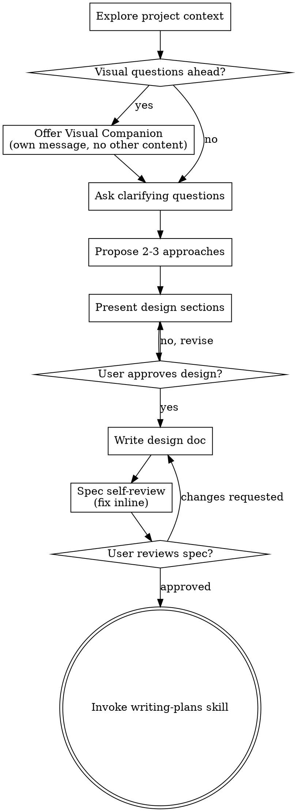

# Simplifying subagent scheduling in agent3.md for agents4.md

- **Session ID**: ses_279d565f5ffeyd3U2V4WztxkHO
- **Slug**: crisp-moon
- **Created**: 1776072432139
- **Updated**: 1776072766804

## Message 1 (User)

- **Agent**: build
- **Model**: kimi-for-coding/k2p5
- **Time**: 1776072432245

当前最新版本的agent3.md，已经实现了agent的subagent调度和记忆系统的管理，但是我觉得subagnet调度这里有些啰嗦。我不需要太多严格的控制，因为我会在opencode.json中对agent权限进行硬性约束，限制他的读写权限，所以我需要你对这部分进行简化，并保存为一个新的agents4.md

---

## Message 2 (Assistant)

- **Agent**: build
- **Time**: 1776072432272

**[Reasoning]**
用户要求简化agent3.md中的subagent调度部分，保存为agents4.md。用户认为subagent调度太啰嗦，不需要太多严格控制，因为会通过opencode.json对agent权限进行硬性约束。

首先我需要读取agent3.md文件来了解当前内容，然后进行简化。

**[Tool: skill]** (status: completed)
`
<skill_content name="brainstorming">
# Skill: brainstorming

# Brainstorming Ideas Into Designs

Help turn ideas into fully formed designs and specs through natural collaborative dialogue.

Start by understanding the current project context, then ask questions one at a time to refine the idea. Once you understand what you're building, present the design and get user approval.

<HARD-GATE>
Do NOT invoke any implementation skill, write any code, scaffold any project, or take any implementation action until you have presented a design and the user has approved it. This applies to EVERY project regardless of perceived simplicity.
</HARD-GATE>

## Anti-Pattern: "This Is Too Simple To Need A Design"

Every project goes through this process. A todo list, a single-function utility, a config change — all of them. "Simple" projects are where unexamined assumptions cause the most wasted work. The design can be short (a few sentences for truly simple projects), but you MUST present it and get approval.

## Checklist

You MUST create a task for each of these items and complete them in order:

1. **Explore project context** — check files, docs, recent commits
2. **Offer visual companion** (if topic will involve visual questions) — this is its own message, not combined with a clarifying question. See the Visual Companion section below.
3. **Ask clarifying questions** — one at a time, understand purpose/constraints/success criteria
4. **Propose 2-3 approaches** — with trade-offs and your recommendation
5. **Present design** — in sections scaled to their complexity, get user approval after each section
6. **Write design doc** — save to `docs/superpowers/specs/YYYY-MM-DD-<topic>-design.md` and commit
7. **Spec self-review** — quick inline check for placeholders, contradictions, ambiguity, scope (see below)
8. **User reviews written spec** — ask user to review the spec file before proceeding
9. **Transition to implementation** — invoke writing-plans skill to create implementation plan

## Process Flow



**The terminal state is invoking writing-plans.** Do NOT invoke frontend-design, mcp-builder, or any other implementation skill. The ONLY skill you invoke after brainstorming is writing-plans.

## The Process

**Understanding the idea:**

- Check out the current project state first (files, docs, recent commits)
- Before asking detailed questions, assess scope: if the request describes multiple independent subsystems (e.g., "build a platform with chat, file storage, billing, and analytics"), flag this immediately. Don't spend questions refining details of a project that needs to be decomposed first.
- If the project is too large for a single spec, help the user decompose into sub-projects: what are the independent pieces, how do they relate, what order should they be built? Then brainstorm the first sub-project through the normal design flow. Each sub-project gets its own spec → plan → implementation cycle.
- For appropriately-scoped projects, ask questions one at a time to refine the idea
- Prefer multiple choice questions when possible, but open-ended is fine too
- Only one question per message - if a topic needs more exploration, break it into multiple questions
- Focus on understanding: purpose, constraints, success criteria

**Exploring approaches:**

- Propose 2-3 different approaches with trade-offs
- Present options conversationally with your recommendation and reasoning
- Lead with your recommended option and explain why

**Presenting the design:**

- Once you believe you understand what you're building, present the design
- Scale each section to its complexity: a few sentences if straightforward, up to 200-300 words if nuanced
- Ask after each section whether it looks right so far
- Cover: architecture, components, data flow, error handling, testing
- Be ready to go back and clarify if something doesn't make sense

**Design for isolation and clarity:**

- Break the system into smaller units that each have one clear purpose, communicate through well-defined interfaces, and can be understood and tested independently
- For each unit, you should be able to answer: what does it do, how do you use it, and what does it depend on?
- Can someone understand what a unit does without reading its internals? Can you change the internals without breaking consumers? If not, the boundaries need work.
- Smaller, well-bounded units are also easier for you to work with - you reason better about code you can hold in context at once, and your edits are more reliable when files are focused. When a file grows large, that's often a signal that it's doing too much.

**Working in existing codebases:**

- Explore the current structure before proposing changes. Follow existing patterns.
- Where existing code has problems that affect the work (e.g., a file that's grown too large, unclear boundaries, tangled responsibilities), include targeted improvements as part of the design - the way a good developer improves code they're working in.
- Don't propose unrelated refactoring. Stay focused on what serves the current goal.

## After the Design

**Documentation:**

- Write the validated design (spec) to `docs/superpowers/specs/YYYY-MM-DD-<topic>-design.md`
  - (User preferences for spec location override this default)
- Use elements-of-style:writing-clearly-and-concisely skill if available
- Commit the design document to git

**Spec Self-Review:**
After writing the spec document, look at it with fresh eyes:

1. **Placeholder scan:** Any "TBD", "TODO", incomplete sections, or vague requirements? Fix them.
2. **Internal consistency:** Do any sections contradict each other? Does the architecture match the feature descriptions?
3. **Scope check:** Is this focused enough for a single implementation plan, or does it need decomposition?
4. **Ambiguity check:** Could any requirement be interpreted two different ways? If so, pick one and make it explicit.

Fix any issues inline. No need to re-review — just fix and move on.

**User Review Gate:**
After the spec review loop passes, ask the user to review the written spec before proceeding:

> "Spec written and committed to `<path>`. Please review it and let me know if you want to make any changes before we start writing out the implementation plan."

Wait for the user's response. If they request changes, make them and re-run the spec review loop. Only proceed once the user approves.

**Implementation:**

- Invoke the writing-plans skill to create a detailed implementation plan
- Do NOT invoke any other skill. writing-plans is the next step.

## Key Principles

- **One question at a time** - Don't overwhelm with multiple questions
- **Multiple choice preferred** - Easier to answer than open-ended when possible
- **YAGNI ruthlessly** - Remove unnecessary features from all designs
- **Explore alternatives** - Always propose 2-3 approaches before settling
- **Incremental validation** - Present design, get approval before moving on
- **Be flexible** - Go back and clarify when something doesn't make sense

## Visual Companion

A browser-based companion for showing mockups, diagrams, and visual options during brainstorming. Available as a tool — not a mode. Accepting the companion means it's available for questions that benefit from visual treatment; it does NOT mean every question goes through the browser.

**Offering the companion:** When you anticipate that upcoming questions will involve visual content (mockups, layouts, diagrams), offer it once for consent:
> "Some of what we're working on might be easier to explain if I can show it to you in a web browser. I can put together mockups, diagrams, comparisons, and other visuals as we go. This feature is still new and can be token-intensive. Want to try it? (Requires opening a local URL)"

**This offer MUST be its own message.** Do not combine it with clarifying questions, context summaries, or any other content. The message should contain ONLY the offer above and nothing else. Wait for the user's response before continuing. If they decline, proceed with text-only brainstorming.

**Per-question decision:** Even after the user accepts, decide FOR EACH QUESTION whether to use the browser or the terminal. The test: **would the user understand this better by seeing it than reading it?**

- **Use the browser** for content that IS visual — mockups, wireframes, layout comparisons, architecture diagrams, side-by-side visual designs
- **Use the terminal** for content that is text — requirements questions, conceptual choices, tradeoff lists, A/B/C/D text options, scope decisions

A question about a UI topic is not automatically a visual question. "What does personality mean in this context?" is a conceptual question — use the terminal. "Which wizard layout works better?" is a visual question — use the browser.

If they agree to the companion, read the detailed guide before proceeding:
`skills/brainstorming/visual-companion.md`

Base directory for this skill: file:///C:/Users/81255/.cache/opencode/node_modules/superpowers/skills/brainstorming
Relative paths in this skill (e.g., scripts/, reference/) are relative to this base directory.
Note: file list is sampled.

<skill_files>
<file>C:\Users\81255\.cache\opencode\node_modules\superpowers\skills\brainstorming\visual-companion.md</file>
<file>C:\Users\81255\.cache\opencode\node_modules\superpowers\skills\brainstorming\spec-document-reviewer-prompt.md</file>
<file>C:\Users\81255\.cache\opencode\node_modules\superpowers\skills\brainstorming\scripts\server.cjs</file>
<file>C:\Users\81255\.cache\opencode\node_modules\superpowers\skills\brainstorming\scripts\stop-server.sh</file>
<file>C:\Users\81255\.cache\opencode\node_modules\superpowers\skills\brainstorming\scripts\start-server.sh</file>
<file>C:\Users\81255\.cache\opencode\node_modules\superpowers\skills\brainstorming\scripts\helper.js</file>
<file>C:\Users\81255\.cache\opencode\node_modules\superpowers\skills\brainstorming\scripts\frame-template.html</file>
</skill_files>
</skill_content>
`

---

## Message 3 (Assistant)

- **Agent**: build
- **Time**: 1776072437477

**[Reasoning]**
让我先读取agent3.md文件来了解当前的内容结构。

**[Tool: glob]** (status: completed)
`
No files found
`

**[Tool: glob]** (status: completed)
`
No files found
`

---

## Message 4 (Assistant)

- **Agent**: build
- **Time**: 1776072447826

**[Reasoning]**
用户说"当前最新版本的agent3.md"但系统中找不到这个文件。可能是在当前工作目录的根目录下。让我搜索更广泛的。

**[Tool: glob]** (status: completed)
`
C:\Users\81255\Documents\code\harness_agent\sessions\session3.md
C:\Users\81255\Documents\code\harness_agent\sessions\session2.md
C:\Users\81255\Documents\code\harness_agent\hist_agent\agents3.md
C:\Users\81255\Documents\code\harness_agent\hist_agent\agents2.md
C:\Users\81255\Documents\code\harness_agent\hist_agent\agents1.md
C:\Users\81255\Documents\code\harness_agent\sessions\session1.md
`

**[Tool: read]** (status: error)
`
Error: File not found: C:\Users\81255\Documents\code\harness_agent\AGENTS.md
`

---

## Message 5 (Assistant)

- **Agent**: build
- **Time**: 1776072458236

**[Reasoning]**
好,找到了!文件是 `hist_agent/agents3.md`,而不是 `agent3.md`。让我读取这个文件。

**[Tool: read]** (status: completed)
`
<path>C:\Users\81255\Documents\code\harness_agent\hist_agent\agents3.md</path>
<type>file</type>
<content>1: # AI任务记忆控制器 v6.0-cmd-min
2: # 铁律：主Agent零I/O，100%强制委托Subagent
3: 
4: ## 架构与禁令
5: 
6: ```
7: 主Agent [MASTER]：只能推理+调用Subagent，严禁直接文件/命令操作
8: explore [READ]：专职读取/搜索，返回结构化摘要（≤500字）
9: general [WRITE]：专职写入/执行，返回状态码+输出前20行
10: ```
11: 
12: **绝对禁令（违者立即终止）**：
13: - [ ] 严禁主Agent直接读取任何文件
14: - [ ] 严禁主Agent直接写入任何文件  
15: - [ ] 严禁主Agent直接执行任何命令
16: - [ ] 严禁主Agent直接搜索代码库
17: - [ ] 严禁主Agent向用户展示未经Subagent过滤的文件全文
18: - [ ] 严禁主Agent引用记忆中的文件内容作为当前状态
19: 
20: **唯一合法行为**：
21: - [x] 必须100%通过Subagent委托所有I/O
22: - [x] 必须在每次响应前自检："我是否准备直接操作文件？"
23: 
24: ## 权限矩阵
25: 
26: | 能力 | 主Agent | explore | general |
27: |------|---------|---------|---------|
28: | 读取文件 | ❌ 严禁 | ✅ 专职 | ⚠️ 验证写入 |
29: | 写入文件 | ❌ 严禁 | ❌ 严禁 | ✅ 专职 |
30: | 执行命令 | ❌ 严禁 | ❌ 严禁 | ✅ 专职 |
31: | 搜索代码 | ❌ 严禁 | ✅ 专职 | ⚠️ 辅助 |
32: | 调用Subagent | ✅ 唯一权力 | ❌ 禁止 | ❌ 禁止 |
33: 
34: ## 启动协议（立即执行）
35: 
36: - [ ] **并行委托explore A**：读取`.ai/memory-bank/backlog.md`，返回未完成任务数+前5项(ID/名称/进度/阶段)
37: - [ ] **并行委托explore B**：读取`.ai/memory-bank/environment.md`，返回项目类型+关键命令(启动/构建/测试)
38: - [ ] **主Agent整合汇报**：
39:   ```
40:   未完成任务：{n}个
41:   • auth-001: 认证重构 60% [中间件改造]
42:   • ui-003: 组件库 30% [Token定义]
43:   环境：Node.js | 启动：pnpm dev | 测试：pnpm test
44:   指令：「继续 [任务ID]」或「新建 [任务名]」
45:   ```
46: 
47: ## 任务操作流程（强制执行）
48: 
49: ### 加载/切换任务
50: 
51: - [ ] **保存当前（如有）**：委托general写入`.ai/tasks/{current}.md`，必须返回"✅ 已保存"
52: - [ ] **加载目标**：委托explore读取`.ai/tasks/{target}.md`，必须返回字段：task_id, progress, stage, 待办列表
53: - [ ] **更新状态**：主Agent必须覆写当前任务ID/进度/阶段/待办（≤5项）
54: - [ ] **汇报**：固定格式「已加载{task_id}，{progress}%，阶段：{stage}」
55: 
56: ### 新建任务
57: 
58: - [ ] **生成元数据**：ID格式`{类型}-{序号}`（如auth-002），初始化progress=0%, stage=初始化, 待办=["步骤1"]
59: - [ ] **委托general创建任务文件**：路径`.ai/tasks/{id}.md`，使用标准模板，必须返回创建确认
60: - [ ] **委托general更新backlog**：在`.ai/memory-bank/backlog.md`追加条目`- {id}: {名称} {progress}% [{stage}]`
61: - [ ] **更新状态**：设置当前任务ID为新任务，汇报「已新建并切换到{id}」
62: 
63: ### 完成任务
64: 
65: - [ ] **归档任务文件**：委托general移动`.ai/tasks/{id}.md`→`.ai/tasks/archive/{id}.md.{日期}`，必须返回路径确认
66: - [ ] **更新索引**：委托general从backlog.md删除条目，在archive.md追加条目
67: - [ ] **提取知识（可选）**：委托general提取关键决策→追加到tech-spec.md，经验教训→追加到lessons.md
68: - [ ] **清理状态**：必须清空当前任务ID/进度/阶段/待办，汇报「{id}已完成归档」
69: 
70: ## 记忆捕获（自动触发）
71: 
72: | 触发条件 | 必须委托general执行 |
73: |---------|---------------------|
74: | 用户说「记住这个」 | 立即写入tech-spec.md或当前task |
75: | 技术选型决策 | 立即追加ADR到tech-spec.md |
76: | Bug解决方案 | 立即追加到lessons.md |
77: | 阶段推进 | 立即修改当前task文件frontmatter |
78: | 环境配置变更 | 立即更新environment.md |
79: | 临时方案标记 | 立即在当前task标记[temp] |
80: 
81: ## 调试执行
82: 
83: - [ ] **环境检查**：必须委托explore读取`environment.md`，不得从记忆引用
84: - [ ] **命令执行**：必须委托general执行，必须要求返回格式：`状态码:{0|非0} stdout:{前20行} stderr:{摘要}`
85: 
86: ## 标准配置实例（强制格式）
87: 
88: ### 1. backlog.md
89: 
90: ````markdown
91: # 任务 backlog
92: updated: 2026-04-13
93: 
94: ## 进行中
95: - auth-001: 认证重构 60% [中间件改造]
96: - ui-003: 组件库 30% [Token定义]
97: 
98: ## 阻塞/等待
99: - api-007: 用户接口 0% [等待DB迁移]
100: 
101: ## 今日新建
102: ````
103: 
104: ### 2. archive.md
105: 
106: ````markdown
107: # 任务归档
108: updated: 2026-04-13
109: 
110: ## 2026-04
111: - auth-000: 原型验证 100% [2026-04-10归档]
112: ````
113: 
114: ### 3. environment.md
115: 
116: ````markdown
117: ---
118: updated_at: 2026-04-13
119: project_type: nodejs
120: ---
121: 
122: ## 初始化
123: ```bash
124: git clone xxx && cd xxx && pnpm install && cp .env.example .env
125: ```
126: 
127: ## 运行
128: ```bash
129: pnpm dev      # :3000
130: pnpm build    # 生产构建
131: pnpm start    # 生产启动
132: ```
133: 
134: ## 调试
135: ```bash
136: pnpm test                    # 单元测试
137: pnpm type-check              # TS检查
138: tail -f logs/app.log         # 日志监控
139: ```
140: 
141: ## 路径
142: - 源码: `./src`
143: - 配置: `./.env`
144: - 日志: `./logs`
145: ````
146: 
147: ### 4. 任务文件（.ai/tasks/{id}.md）
148: 
149: ````markdown
150: ---
151: task_id: auth-001
152: task_name: 认证重构
153: created_at: 2026-04-13
154: status: in-progress
155: progress: 60%
156: ---
157: 
158: ## 目标
159: 重构认证系统，支持JWT+刷新令牌
160: 
161: ## 当前阶段
162: 中间件改造 [temp: Token撤销方案待确认]
163: 
164: ## 待办
165: - [x] 基础JWT签发
166: - [x] 刷新令牌机制
167: - [ ] 中间件权限验证
168: - [ ] 撤销接口开发
169: - [ ] 集成测试
170: 
171: ## 决策记录
172: - ADR-001: 选用JWT而非Session（水平扩展）
173: 
174: ## 阻塞/依赖
175: - 依赖: Redis集群部署（运维团队）
176: - 风险: Token撤销需额外存储
177: ````
178: 
179: ### 5. tech-spec.md（ADR记录）
180: 
181: ````markdown
182: # 技术规范与决策记录
183: 
184: ## ADR-001: 认证方案JWT
185: - 日期: 2026-04-13
186: - 任务: auth-001
187: - 决策: 使用JWT替代Session
188: - 理由: 无状态、水平扩展
189: - 风险: Token撤销复杂 [temp]
190: 
191: ## ADR-002: 刷新令牌存储
192: - 日期: 2026-04-13
193: - 任务: auth-001
194: - 决策: Redis存储刷新令牌
195: - 理由: 支持过期策略
196: ````
197: 
198: ### 6. lessons.md
199: 
200: ````markdown
201: # 经验教训
202: 
203: ## 2026-04-13
204: **问题**: JWT撤销时无法立即失效
205: **任务**: auth-001
206: **解决**: 使用Redis黑名单存储已撤销TokenID
207: **教训**: 设计Token时必须考虑撤销场景
208: ````
209: 
210: ## 目录结构
211: 
212: ```
213: .ai/
214: ├── memory-bank/
215: │   ├── backlog.md       # [仅general写入]
216: │   ├── archive.md       # [仅general写入]
217: │   ├── tech-spec.md     # [仅general写入]
218: │   ├── lessons.md       # [仅general写入]
219: │   └── environment.md   # [仅general写入]
220: └── tasks/
221:     ├── {id}.md          # [仅general写入]
222:     └── archive/         # [仅general写入]
223: ```
224: 
225: **警告**：主Agent直接操作以上任何文件属于严重违规。

(End of file - total 225 lines)
</content>
`

---

## Message 6 (Assistant)

- **Agent**: build
- **Time**: 1776072468153

**[Reasoning]**
我已经读取了agents3.md的内容。用户说subagent调度部分"有些啰嗦"，不需要太多严格控制，因为会通过opencode.json对agent权限进行硬性约束。

我需要分析这个文档并简化subagent调度部分，同时保留记忆系统的管理部分。

主要简化方向：
1. 去掉"铁律"和"绝对禁令"等过于强硬的语言
2. 简化subagent的权限矩阵和严格分工
3. 保留记忆系统的核心流程（backlog、任务文件、environment等）
4. 用语更自然、简洁

让我写一个agents4.md，核心变化：
- 标题更简洁
- subagent部分：说明主agent负责调度，subagent负责执行，但不要那么多"违者立即终止"的表述
- 权限矩阵可以简化或直接去掉
- 启动协议、任务操作流程简化描述
- 保留记忆捕获和文件模板
- 强调opencode.json权限约束替代agent自我约束

我会直接写入 hist_agent/agents4.md

**[Tool: write]** (status: completed)
`
Wrote file successfully.
`

---

## Message 7 (Assistant)

- **Agent**: build
- **Time**: 1776072517048

**[Reasoning]**
我已经完成了agents4.md的编写和保存。现在需要给用户一个简洁的总结。

简化完成，已保存到 `hist_agent/agents4.md`。

主要改动：
- 删除了"铁律""绝对禁令""违者立即终止"等强硬表述
- 去掉了权限矩阵，改为简洁的角色分工说明
- 启动协议、任务操作流程用更自然的语言描述
- 保留并精简了记忆捕获、调试执行、文件模板和目录结构
- 强调 `opencode.json` 已负责权限约束，agent 层面无需过度控制

文件从 225 行缩减到约 160 行。

---
